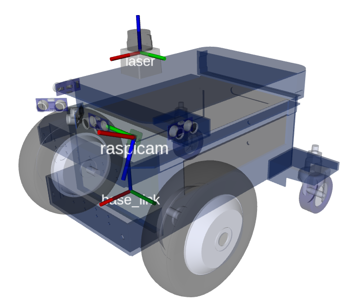

# Setting up ubiquity robotics default lidar

#### &uarr;[top]( https://ubiquityrobotics.github.io/learn/)

In this document it is described how to set up the UR50 lidar on the Magni.

# Mounting the lidar

## Default location

The default location of the lidar is on the top plate looking into the forward direction. Top plate comes with holes ready for the lidar to be mounted (if the holes are not there, mount the lidar with the double sided tape, making sure its 1.) turned exactly forward - a slight offset in angle can result in inacurate localisation and 2.) its center is exactly in between the front two mounting holes)

On the picture red, green, blue corespond to x, y and z axis
## (OPTIONAL) Custom location

The robot needs to know the exact position and orientation of the lidar relative to base_link frame. The robot comes pre-configured, thinking the lidar is on the top plate position, so if you place it in another position, make sure you make appropriate changes to this line: 

https://github.com/UbiquityRobotics/magni_robot/blob/718ac91b8c592408dd911db2a818887e50d1880c/magni_description/urdf/magni.urdf.xacro#L207

Those numbers respectively represent how lidar is displaced in x,y,z,roll,pitch,yaw axes relative to the robot base_link frame which is exactly between the two front wheels.

***
# Setup to work with RaspberryPi

## Location of the lidar on the robot

When running on an actual robot, lidar also needs to be enabled in robot.yaml. You can do that by editing the 

    sudo nano /etc/ubiquity/robot.yaml

## Network
The lidar should come pre-configured with static IP: 192.168.42.222 and only answering to requests comming from IP 192.168.42.125, so we need to configure that on the RPI.

A static interface needs to be set on RPIs lan port by editing the interfaces file

    sudo nano /etc/network/interfaces

we need the eth0 interface to have a static address of 192.168.42.125/24. After the necesseary additions are made, the interfaces file looks something like this:

    # interfaces(5) file used by ifup(8) and ifdown(8)
    # Include files from /etc/network/interfaces.d:
    source-directory /etc/network/interfaces.d

    # The loopback network interface
    auto lo
    iface lo inet loopback

    auto eth0
    iface eth0 inet static
    address 192.168.42.1/24
    gateway 0.0.0.0
    dns-nameservers 8.8.8.8

# Running

<!-- TODO add compiling and running once we have the repo with the URLIDAR setup -->
<!-- TODO before this tutorial is written, lidar extrinsics should be configured through robot.yaml -->