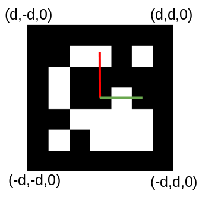

# Fiducial-Based Localization

In this section, we describe our approach to fiducial-based localization.c
This is one of the ways in which a robot's position in the `world` can
be determined.  For a discussion of other approaches, see the
[Navigation and Localization Overview](../overview/overview.md).

This document assumes that you are running the software on a Ubiquity
Robotics robot base, using the supplied Raspberry Pi camera.

## Basic Concept

If you're eager to start localizing your robot, and don't wish to read about
how fiducial localization works, you can skip reading this sub-section.

The Ubiquity Robotics localization system uses a number of fiducial markers
of known size to determine the robot's position.  Detection of the markers
is done by the [aruco_detect node](http://wiki.ros.org/aruco_detect).
For each marker visible in the image, a set of vertices in image coordinates
is produced.  Since the *intrinsic parameters* of the camera and the size
of the fiducial are known, the pose of the fiducial relative to the camera can
be estimated. Note that if the camera intrinsics are not known, they can
be determined using the process described in the
[camera calibration tutorial](http://wiki.ros.org/camera_calibration/Tutorials/MonocularCalibration).

The diagram below shows the coordinate system of a fiducial marker, which has a
length of *2d*.  The image coordinates *(x, y)* of each vertex correspond
to a ray from the camera.  The pose estimation code solves a set of linear
equations to determine the world *(X, Y, Z)* coordinate of each of the
vertices. From this, we obtain the *transform* of the fiducial's coordinate
system to the camera's coordinate system *T<sub>fid_cam</sub>*. This
represents the *pose* of the marker in the camera's coordinate system.  Since
we know the camera's pose in the coordinate system of the robot,
*T<sub>base_cam</sub>*, we can combine the two to determine the robot's pose
in the map, *T<sub>map_base</sub>*.



Construction of the map is performed by the
[fiducial_slam node](http://wiki.ros.org/fiducial_slam). It performs
Simultaneous Localization and Mapping (SLAM) based on the fiducial transforms.
The mapping part requires that more than one marker is visible in an image.
In the diagram below, two fiducials, *fid1* and *fid2* are shown. If *fid1*
is at a known pose in the world, *T<sub>map_fid1</sub>* and we know the
marker to camera transforms for both markers, we can compute the pose of
*fid2* thus:

        *T<sub>map_fid2</sub> = T<sub>map_fid1</sub> * T<sub>cam_fid2</sub> * T<sub>fid1_cam</sub>*

In this way, the map is built up as more fiducial pairs are observed, however
multiple observations are combined.


## Printing Fiducials

A PDF file containing a range of fiducial markers can be generated with a
command such as:
```rosrun aruco_detect create_markers.py 100 112 fiducials.pdf```

The *100* and *112* specify the starting and ending numerical IDs of the
markers.  It is not important what these are (we recommend starting at 100),
but it is important that each marker has a unique ID.  This PDF file can
be printed to produce the fiducials.  They can be affixed to any convenient
surface, such as a ceiling, where they will be viewed by the robot's camera.
They need to be at a sufficient that more than one is visible at
a time.

## Running the software

The following command launches the detection and SLAM nodes on the robot:

```roslaunch magni_nav aruco.launch```

It should be run for the first time with at least one marker visible.
A map (this is a file of fiducial poses) is created such that the current
position of the robot is the origin.

## Using rviz to monitor map creation

The following command can be used on a laptop or desktop to run the
[robot visualization tool](http://wiki.ros.org/rviz), rviz.

[Link here to the tutorial where we explain ROS_MASTER_URI]


```roslaunch fiducial_slam fiducial_rviz.launch```

This will produce a display as shown below.  The bottom left pane shows the
current camera view.  This is useful for determining if the fiducial density
is sufficient.  The right-hand pane shows the map of fiducials as it is being
built. Red cubes represent fiducials that are currently in view of the camera.
Green cubes represent fiducials that are in the map, but not currently
in the view of the camera. The blue lines show connected pairs of fiducials
that have been observed in the camera view at the same time.  The robustness
of the map is increased by having a high degree of connectivity between the
fiducials.


