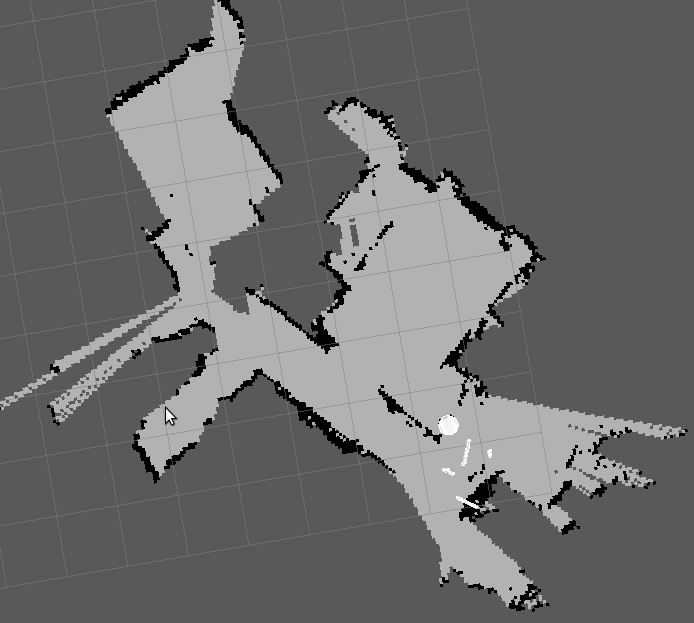

# Autonomous Navigation

In order to have a robot be able to respond to a command such as
"go to the kitchen", we must address the following three requirements:

* The current position of the robot must be known. This is referred to as
  *localization*
* We must have some representation of our environment, so that a path
  can be planned from the robot's current position to the destination.
* There is some way to deal with unexpected obstacles on the way.

Much literature has been published on these tasks, and there is plenty of
open source ROS software available.  We provide a overview
of the approaches below, and then discuss the 
*Ubiquity Robotics Approach*

## Localization
 
The most common approach to localization in ROS robots is to build a map,
such as the one below using a Light Detection and Ranging (LIDAR) sensor,
and software such as [gmapping](http://wiki.ros.org/gmapping).

Once a map of the environment exists, Adaptive Monte-Carlo Localization (AMCL)
can be used to estimate the robot's position within the map. This approach,
which is also referred to as a *particle filter*, in effect simulates many
robots in the environment and estimates how well the observed LIDAR scan
fits with the simulated robots' position within the environment.
The [ROS AMCL node](http://wiki.ros.org/amcl) is often used for this.

## Navigation

[To be written]

## Obstacle Avoidance

[To be written]

## The Ubiquity Robotics Approach

In the *Ubiquity Robotics Approach*, we try to provide a rewarding robotics
experience, by applying some constraints to make the tasks more achievable.
The intention is that you will be able to get something working, and can then
choose to move on to use more sophisticated approaches.

We did this for two reasons, first we observed that people new to robotics
would struggle to configure tune navigation software. and second we wanted
to provide a low-cost robot base, so we avoided costly LIDAR sensors.
Of course, you are free to add sensors to your robot base, if you so desire.

### Fiducial-Based Localization

The LIDAR-based localization approach described above has several
disadvantages:

* Making the map is laborious and (depending on the software used) it
  can be difficult to update an existing map.

* Good quality LIDAR sensors are expensive (typically upwards of $1000).
  Lower-cost sensors (such as Kinect RGBD sensors) can be used, but they are
  less accurate, particularly as the distance from the robot increases.

* The AMCL approach requires initialization, which is typically done
  by the user asserting a location using the
  [rviz robot visualization tool](http://wiki.ros.org/rviz).

* Unless an expensive high-range LIDAR sensor is used, it is difficult
  to map out large areas.

* AMCL does not deal well with the ambiguity that arises from having
  similar geometries (such as corners of rooms) in multiple locations.

* If the furniture is rearranged, the map needs to be updated.
  
To address these shortcomings, we developed a localization system that
uses the low-cost Raspberry Pi camera to estimated the robot's position
from *fiducial markers* that are placed around the environment.

See [Fiducial Based Localization](../fiducials/fiducials.md) for more
details.

### Simple Navigation with move_basic

See [Simple Path Planning](../move_basic/move_basic.md)

## Bibliography

[Do we want a bibliography for the whole documentation, or one here?]