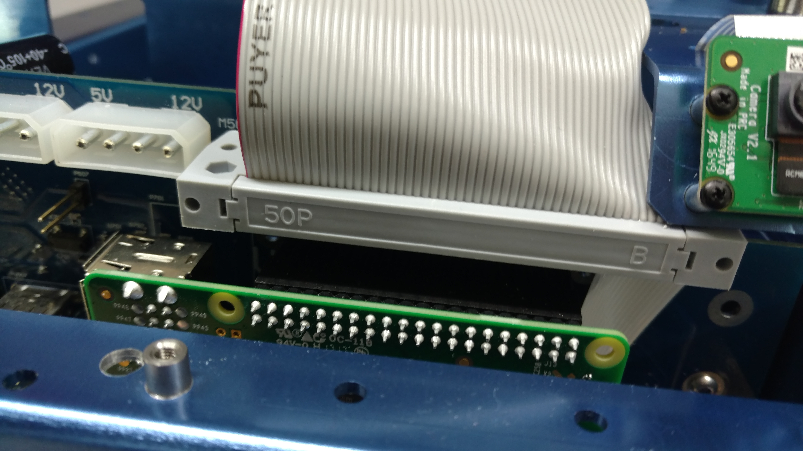
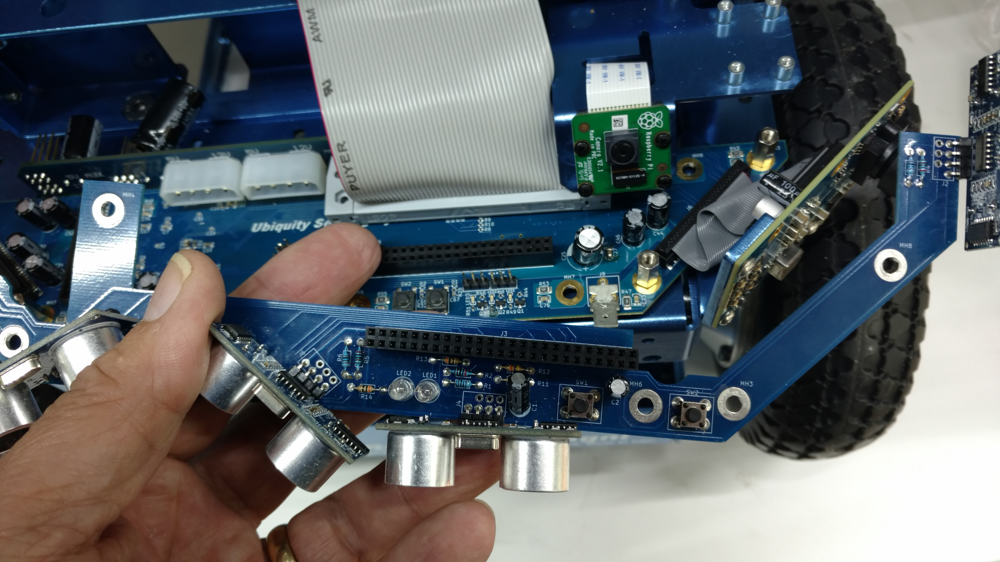
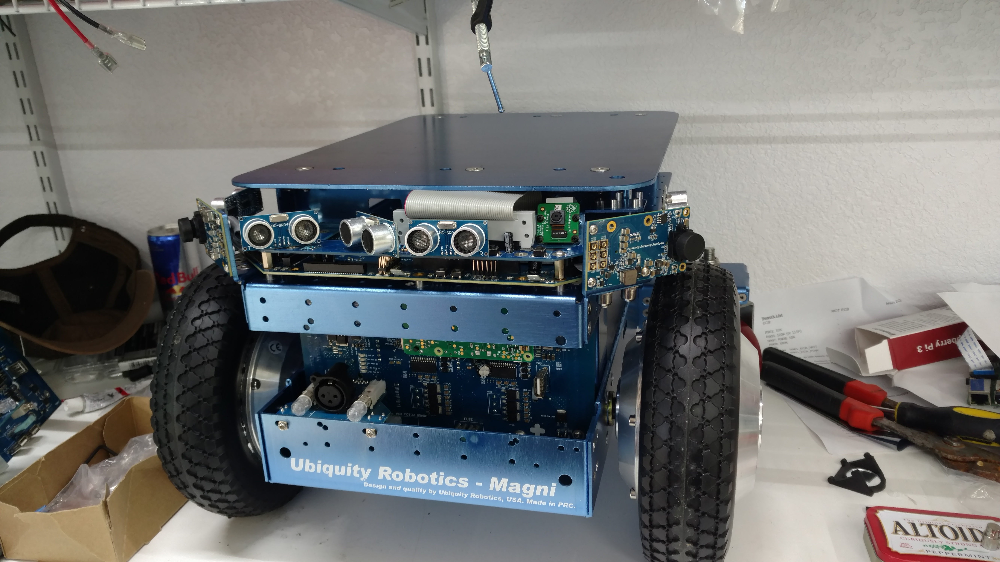

Camera and Sensor Installation.

Depending on your version of Magni, you may have a different suite of sensors.Silver and Gold versions come with a Raspicam. the Raspicam is needed for fiducial follow, partybot and waypoint navigation. The Silver version comes with a sonar short 
range obstacle avoidance system, and the Gold version inclused both the sonar and an IR long range obtacle avoidance package.

Camera installation

The easiest way to install the camera is to remove the the Pi, attache the camera to the mounting bracket, and thread the cable through the slot holding the camera.

Then attach the cable to the Pi, the 'blue' part of the cable faces toward the USB ports

 
 
 Then reinstall the Pi, making sure the pins are aligned correctly. (Mis-aligned pins will cause the Pi to fail!)

To begin the sensor package installation, insert one end of the 50 pin ribbon cable into the Main controller board, the socket is above the Raspberry Pi. The next steps concern the Gold version IR sensor package.  If you donot have this sensor, skip these steps and continue to sonrar sensors.

Insert the ribbon cable on both the left and right IR cameras

The cmaeras are installed with thre M6 bolts.

