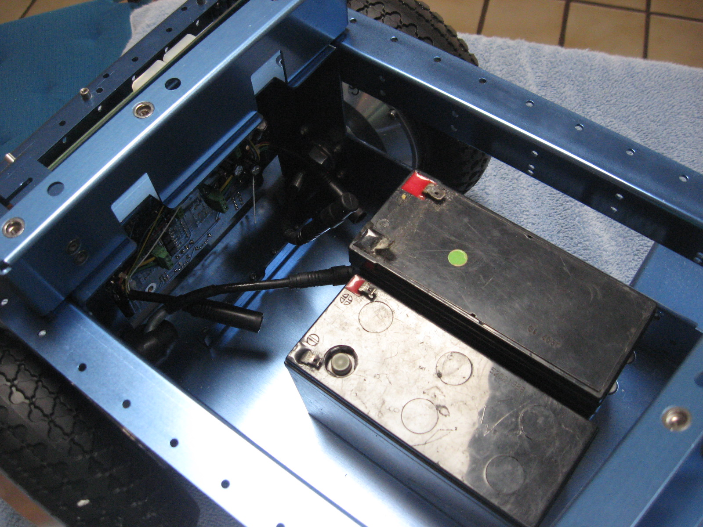

** Unboxing and Assembling a Magni Robot

The Magni comes almost ready to run with minimal assembly. Most will come with a Raspiberry Pi 3 computer and software image (Silver and Gold). The Bronze version will not come with the computer. 2 12v SLA batteries are purchased separately.
*{Wayne: SLA = Seal Lead Acid. Bronze, Silver, Gold are versions of Magni.  The list of tools needed for assembly
should be centralized and listed. }*

Step 1 - open the box

 
 
 Inside the box you will find the battery cables, barckets for the cover plate, fasteners, and a cover plate.
 *{Wayne: The picture does not show the cover plate.  However, it does show the robot. }*
 
 
 
 After removing the robot, the coverplate is stored at the bottom of the shipping box.
 
 
 
 The Raspberry Pi 3 + SD image card can be installed(Silver and Gold).
 *{Wayne: Where did the RasPi3 come from?  It is not mentioned or shown in the box.  Are there screws for
 attaching the RasPi to the main board.  Where is the microSD card stored.  Is there any way to distinguish
 it from other microSD cards?  Where is the microSD card installed?  (Hint: It is on the bottom of the RasPi3.)
 Also, are there lock washers for the RasPi3.  Since robots vibrate, they need lock washers. }*
 
 
 
 The front and back barackets can be installed using theThey Brackets require a 4mm hex (Allen wrench) We suggest an extra long (6 cm). The other included fasteners are 2mm hex and a small Phillips screw for Raspi Cam attachment
 *{Wayne: Multiple typos and grammar errors.  We `unbparts.JPG` shows the battery cables, a bag of screws, and
 two plastic blobs that should be unwrapped.  Also, in the US, metric hex wrenches are not in most people's
 toolbox.  We should ship with the required hex wrenches.  Robots vibrate and need lock washers. }*
 
 
 
 
Rear Bracket
*{Wayne: We need some text here.  The link shows the front of the robot, not the rear. }*

Front Bracket with Camera.  The power switches are system above the "U" in Ubiquity, and wheels above the "y'. The charging port is between the two switches. Switches light up when on.

The Motors are connected next
*{Wayne: No camera is visible. The electrolytic capacitor looks damaged.  Is there a camera bracket?
If so, where did it come from?  What does it look like.  The text in this section is incompete and 
does not really describe what is in the picture. }*

Finally the batteries are connected. The red lead from battery 1 to positive, the black from ground to ground on battery 2, and the yellow to connect the negative ove battery 1 to the positive of battery 2.
*{Wayne: Somewhere there needs to be a discussion of what size batteries to use.  The spade connector sizes need
to be specified.  The user should be prepared for a current inrush spark.  The user also needs to buy a SLA
battery charger.  Is there a strap to hold the batteries down?  How is it installed? }*

A video of this process will be available at:  https://youtu.be/pF38kFOl0Ic
*{Wayne: Use present tense. }*
