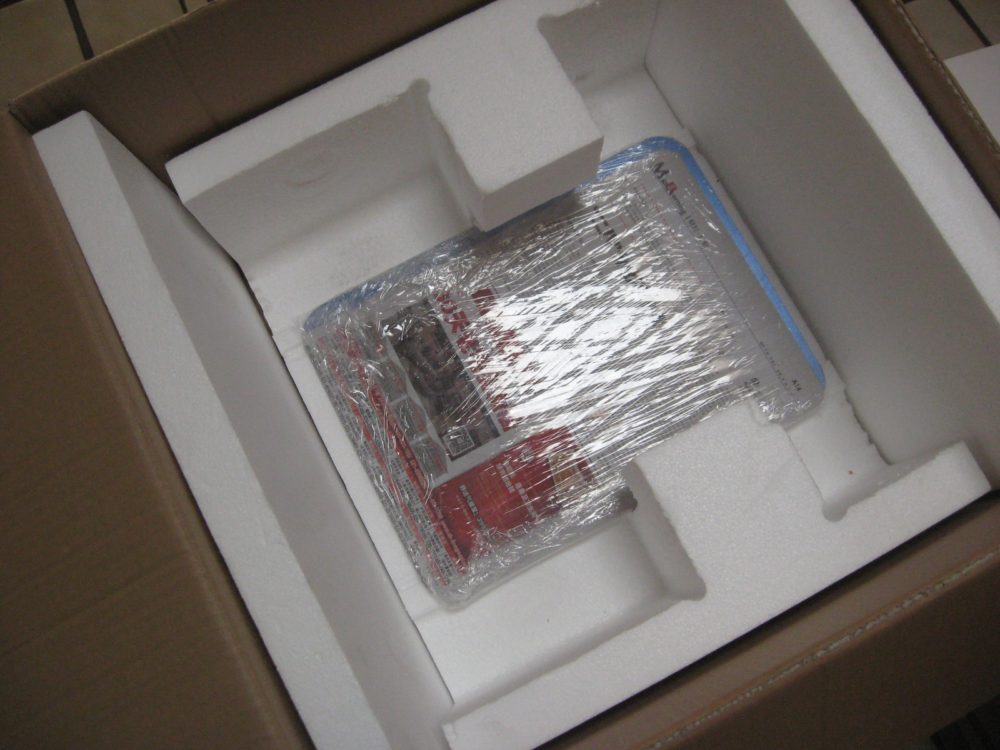
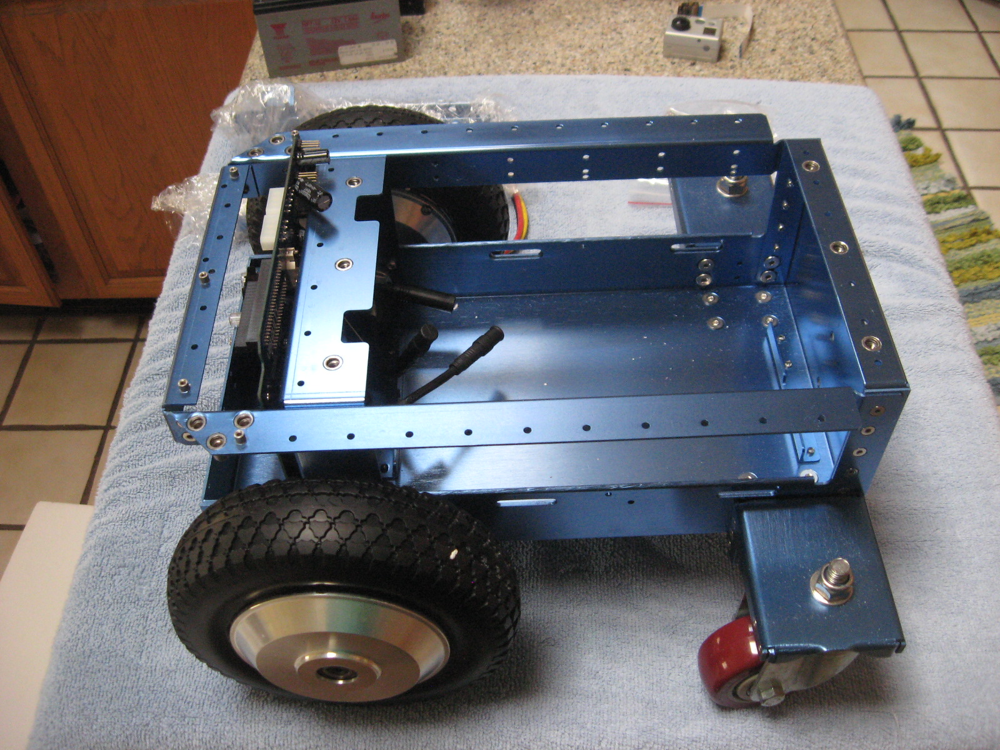

** Unboxing and Assembling a Magni Robot

The Magni comes almost ready to run with minimal assembly. There are three different version of Magni: Bronze, Silver and Gold. Most will come with a Raspiberry Pi 3 computer and software image (Silver and Gold). The Bronze version will not come with the computer. 2 12v SLA (Sealed Lead Acid) batteries are purchased separately. Two AlLen wrenches (M3 and M6) will be included in the shipping box. In addition a small Phillips (cross point) screw driver may be needed for mounting the Raspberri Pi camera.

Step 1 - open the box

 

 Inside the box you will find the battery cables, brackets for the cover plate, fasteners, and a cover plate.

 

 After removing the robot, the cover plate is stored at the bottom of the shipping box.

 

 The Raspberry Pi 3 + SD image card can be installed(Silver and Gold). As of this update, it is believed the RPi 3 will be installed at the factory, but it is not known if the SD card with the operating system and robot software will be inserted.

 

  In the small parts bags, you will find fastners and M6 and M3 Allen wrenches that fit the included fasteners. The additional sensors (Silver and Gold versions) are wrapped separately.

 

 The front and back brackets can be installed using the brackets require a M6 hex (Allen wrench) We suggest an extra long (6 cm). The other included fasteners are M3 hex and a small Phillips screw for Raspi Cam attachment. 

Brackets

Front Bracket with Camera.  The power switches are system above the "U" in Ubiquity, and wheels above the "y'. The charging port is between the two switches. Switches light up when on. The on position is with the switch extended out, the left (closest to the wheel, turns on the system power, and the right most switch enables power to the wheels. Both buttons should be lit. It is a major error to attempt to operate the robot with the power to the wheels off. Comands will be stored by the robot and then when power is enabled, the robot may move unexpectedly. Installing the camera is discussed separately.

The Motors are connected next. This should be done at the factory, If they are detached, there are arrows on the connectors that (-> <-) show the allignment. These connectors are sometimes hard to insert and separate, because hard to grip them.

  

Finally the batteries are connected. The red lead from battery 1 to positive, the black from ground to ground on battery 2, and the yellow to connect the negative of battery 1 to the positive of battery 2. There are cables for both spade type and screw type battery terminals. A 24 volt battery charger is included in the package (Photo not available). The recommended batteries are of the type specified by UB12xxx  where xxx specifies Amp Hours.  Commonly UB1250, UB1290, or UB12150 are used.
Since it is unknown what size and shape the batteries will be it is the user's reponsiblity to see thay are secured in the chassis by the use of straps or packing material.

*{Wayne: Somewhere there needs to be a discussion of what size batteries to use.  The spade connector sizes need
to be specified.  The user should be prepared for a current inrush spark? (not sure that this still occurs on initial battery insertion)  Is there a strap to hold the batteries down?  How is it installed? }*

A video of this process is available at:  https://youtu.be/pF38kFOl0Ic

<<[back](ix_quick_start)- - - - - - - - - - [next](logitech)>>
