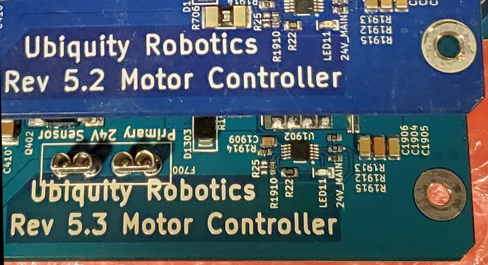
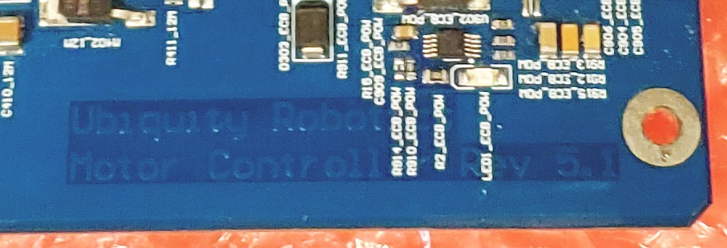

#### &uarr;[top]( https://ubiquityrobotics.github.io/learn/)

## PC Board Revision Identification
This page describes how to identify PC board Revisions used in the Magni robot.

- Raspberry Pi Host Computer
- Main Control Board (MCB)
- Switch board

### Raspberry Pi Host Computer

Starting in mid 2020 we started to ship the Raspberry Pi 4 host computer that is inserted into the MCB board so that only the bottom is visible and even that is hard to see due to the robot chassis.  The easiest way to tell which general Raspberry Pi you have (3 vs 4) is to look at the USB and Ethernet jacks as follows.
- Pi 4 middle 2 jacks use blue plastic for USB 3.0 ability.
- Pi 4 Ethernet jack will be the top metal jack (bottom on Pi3)
- Pi 3 will have a large square 1.2cm black chip on the bottom of the board

The best identification is to use this linux command from an ssh command line shell into the robot which will also show the rev of Pi3 or Pi4

    cat /sys/firmware/devicetree/base/model

- Typical Pi3 reply:  `Raspberry Pi 3 Model B Plus Rev 1.3`
- Typical Pi4 reply:  `Raspberry Pi 4 Model B Rev 1.2`

### Main Control Board Identification

All of the Main Control Boards, also called MCB, have a version number on the top of the board that is printed along the left edge of the PC board on the top copper layer.   

Because prior to rev 5.2 the version number is very hard to read we will supply pictures to help with board version identification prior to rev 5.2

A detailed list of main MCB hardware changes as well as firmware revisions can be found on our [Firmware_Hardware_Revisions](https://github.com/UbiquityRobotics/ubiquity_motor/blob/kinetic-devel/Firmware_and_Hardware_Revisions.md) github page.

#### Revision 5.2 And Later Main Control boards

Starting with version 5.2 the large text for the board revisions are printed in bright white silkscreen on the left edge of the board.  This page will not describe physical differences to identify the boards because the board revision is clearly marked.  Below shows rev 5.2 and rev 5.3 left edge markings.



#### Revision Markings On Rev 5.1 and earlier

All MCB boards have the revision on the left edge of the PCB but bright white silkscreen was only started to be used as of rev 5.2.  Below is an enhanced picture of a rev 5.1 board to better show what is there.  These markings are very low contrast but are present on all MCB boards.




#### Revision 5.1 Main Control Board

Starting with revision 5.1 the rev is also shown on the top silkscreen under the large text of Ubiquity Robotics.  This text is normally under the Raspberry Pi controller and so was hard to see.

The following items identify a rev 5.1 board.

* The white label with board serial number on the top will start with 39 (2019)
* Mid right edge of the board will have a 1.4 inch square outline for a display
* The P2 jack in mid right will be black plastic female 4-pin jack
* A thick white strip is on the right edge for notes as required.
* The large black MosFet transistor in lower right will fit the pads on the PC board.


#### Revision 5.0 Main Control Board

These items identify a rev 5.0 board besides the top copper board rev in bottom left.

* The white label with board serial number on the top will start with 38 (2018)
* Mid right edge of the board will have a 1.4 inch square outline for a display
* The P2 jack in mid right will be a 4-pin male header
* A thick white strip is on the right edge for notes as required.
* The upper left of the board will have a large capacitor on its side with white glue

  

#### Revision 4.9 Main Control Board

These items identify a rev 4.9 board besides the top copper board rev in bottom left.

* It has no serial number stick-on tag like all rev 5.x boards will have on the MCB
* No white stripe of top silkscreen along the right edge and it has not P2 there either
* The top layer text on the left will be bordered by top layer full copper PC layer.

  

#### Revision 4.7 Main Control Board

These items identify a rev 4.7 board besides the top copper board rev in bottom left.
THE REV 4.7 BOARD WAS A PRE-PRODUCTION BOARD FOR EVALUATION

* It has no serial number stick-on tag
* No white stripe of top silkscreen along the right edge and it has not P2 there either
* The board has not top layer of copper so large areas much darker than other areas will show through the top of the board and the text on the far left will not seem to be 'boxed' in copper.
* The 14-pin jack that holds the switch board had to be cut to not hit a large transistor.
* The large 50-pin jack in upper right will be a female jack for this pre-production board

  


### The Power Switch Board Revisions

There were several versions of switch boards from pre-production through first shipment of units using the rev 4.9 MCB. The revision number only started to appear on rev 2.0 switch boards shipped at the time of the rev 5.0 MCB boards.


#### Switch Boards With Remote Switch Connectors

In order to support user needs to place the main power switch and/or the ESTOP switch in a location that is on their robot cover or perhaps is more accessible due to the customer physical additions we developed the revision 2.2 switch board seen below

  

The revision 2.2 board has P202 seen in the back right that is wired in series with the red keycap ESTOP switch on the board.   Our plan is we will ship the connector that mates with P202 that has one piece of wire sorted to itself.  In this way P202 is shorted from the factory and a user may remove this jack and put two wires going to his own ESTOP switch for his own robot needs.

However it is done ```P202 MUST be connected``` or no motor power will be enabled

On the back left you see P201 which is wired in parallel with the black main power switch.  The thought here is users who want a remote main power switch connect a connector to two wires and then leave the installed main power switch OFF or pushed in.  The customer switch will then be the power switch.

For either ESTOP switch or Main Power switch we ship one jumper that can be modified but sometimes for replacment boards you may want the part numbers for the cable.  Ideally a crimp tool would be used for the pins but it is possible to manually solder onto pins although that is time consuming and a little tricky to wrap the crimp metal around the wire so the pin will fit in the housing.  

    Plastic Housing:  Molex 0009501021.  Digi-Key Part Num WM18813-ND
    Female Pins:      Molex 0008701031.  Digi-Key part Num WM18820CT-ND

#### Switch Boards To Support Rev 5.x MCB Boards

* The main thing to watch for is if the board has 3 resistors it is old for rev 4.9 or earlier MCB boards.

* A REV 5.x MCB  REQUIRES A 4 RESISTOR DESIGN AND BE LABELED REV  2.x or later.

* A rev 2.x switch board with 4 resistors can be used with earlier MCB boards.

  

#### Very early pre-production Switch boards

In early prototypes there were switch boards with large white switches that had green leds in them to show the state.  These should not be in production units unless some sort of replacement had to happen early in first production units.
